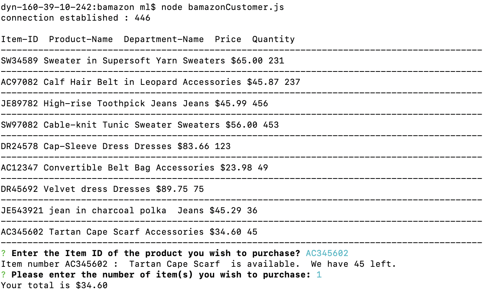
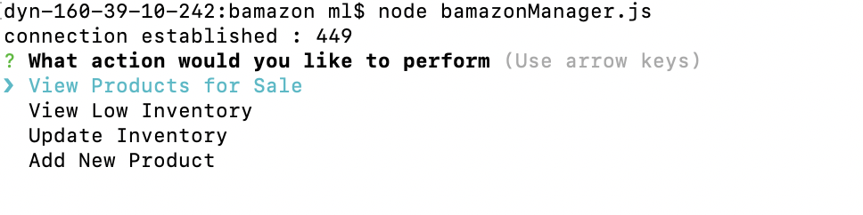
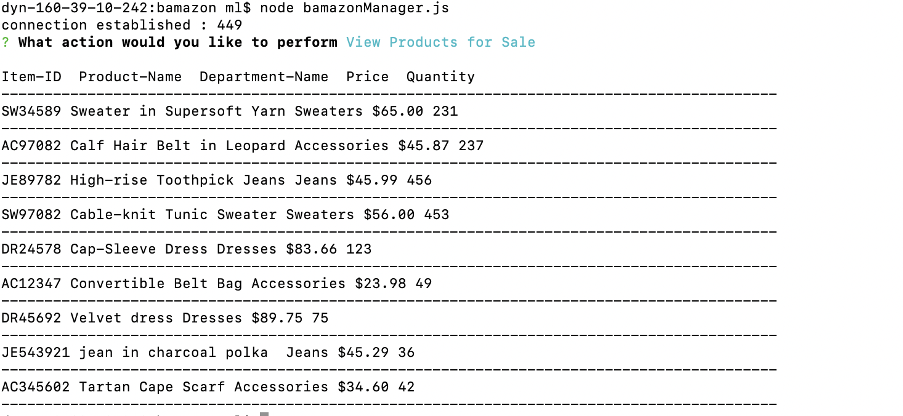
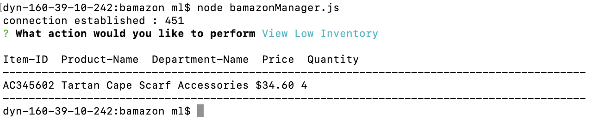
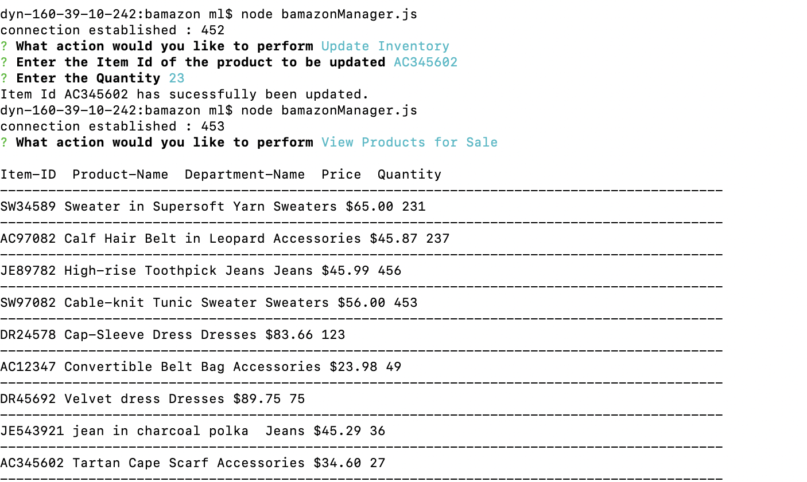
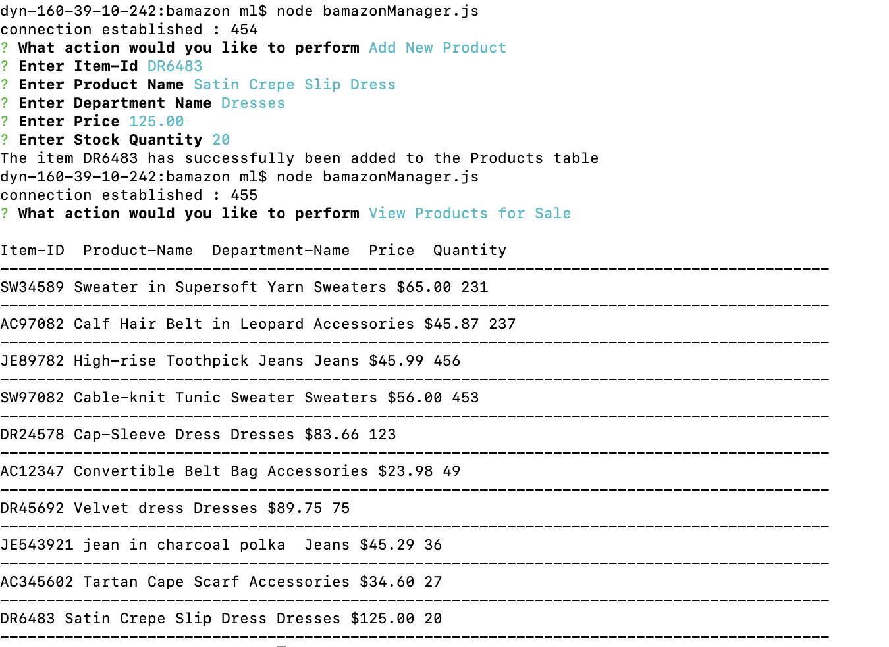
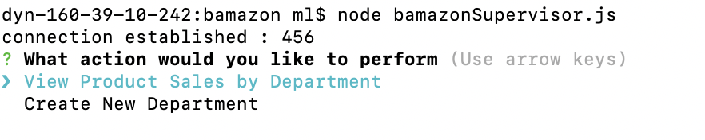
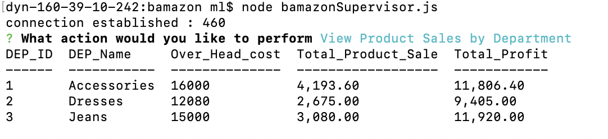
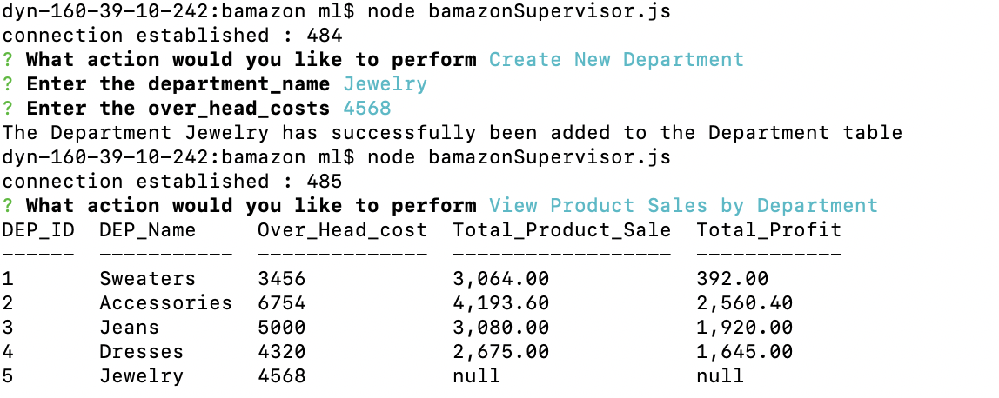

# bamazon app

###Note: To run the **bamazon** use the bamazon.sql file to create the bamazon datbase ans tables.
##Remamber to replace the **passworord** in the databse connection section.

##Customer View 

The **bamazon** MySQL Database contains the **products** table, which has the following columns:

1. item_id (unique id for each product)
2. product_name (Name of product)
3. department_name
4. price (cost to customer)
5. stock_quantity (how much of the product is available in stores)

The Node application **bamazonCustomer.js** first displays all of the items available for sale then prompts the the with two messages:

ID of the product they would like to buy
How many units of the product they would like to buy

Once the customer has placed the order, bamazonCustomer.js app checks the products table to ensure that the inventory meets the customer's request.
The app lets the customer know the total cost of their purchase and the products table is updated to reflect the remaining quantity.

If the the request exceeds the store  inventory, the app logs a message to alert the customer and  prevents the order from going through.

bamazonCustomer.js app so that when a customer purchases anything from the store, the price of the product multiplied by the quantity purchased is added to the product's product_sales column.

##Manager View 

The Node application **bamazonManager.js.** promts the user with the followin options:

  1. View Products for Sale
  2. View Low Inventory
  3. Update Inventory
  4. Add New Product
  5. product_sales

  

The **View Products for Sale** option list the items avialable in the **products** table.

The **View Low Inventory** option list all items with an inventory with a count lower than five.

The **Update Inventory** option allows the user update the  count of the item in the products table.

The **Add New Product** option allows the user insert a new item in the products table.

## Supervisor View

The **Supervisor View** encomapses the **departments** table with the following columns:

1. department_id
2. department_name
3. over_head_costs 

The bamazonSupervisor.js. list the following  options:

1. View Product Sales by Department
2. Create New Department

The **View Product Sales by Department** option  summarizes table in their terminal/bash window. Use the table below as a guide. The total_profit column should be calculated on the fly using the difference between over_head_costs and product_sales. total_profit should not be stored in any database.

The **Create New Department** option alows the user to insert a new item into the **departments** table.

